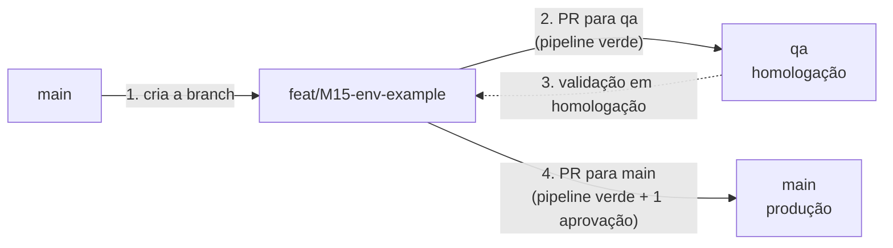

# Como contribuir: ecossistema Omega

Este guia vale para **todos os repositórios da organização GitA8telecom** que não tenham um `CONTRIBUTING.md` próprio. Leia antes do primeiro commit.

Contexto técnico do ecossistema: [`omega-infra/docs/ECOSSISTEMA.md`](https://github.com/GitA8telecom/omega-infra/blob/main/docs/ECOSSISTEMA.md) e [plano técnico](https://github.com/GitA8telecom/omega-infra/blob/main/docs/PLANO-TECNICO-REORGANIZACAO.md).

## Branches

| Branch | Ambiente | Como recebe código |
|---|---|---|
| `main` | **Produção** | Só por **Pull Request**, com **pipeline verde** e **no mínimo 1 aprovação**. Push direto bloqueado |
| `qa` | **Testes e homologação** | Só por **Pull Request**, com **pipeline verde**. Push direto bloqueado |
| `<tipo>/<id>-<descricao>` | — | Trabalho do dia a dia. **Sempre criada a partir da `main`** |
| `hotfix/<descricao>` | — | Correção urgente de produção. Também parte da `main` (ver abaixo) |

Cada ambiente tem sua branch para que várias entregas possam ser testadas em paralelo sem que nada não aprovado chegue à produção. A `main` só recebe entregas inteiras, validadas e revisadas.

## Fluxo de uma entrega



1. Atualize a `main` e crie sua branch a partir dela:
   ```bash
   git switch main
   git pull
   git switch -c feat/M15-env-example
   ```
2. Faça commits pequenos, seguindo a convenção (abaixo), e envie a branch: `git push -u origin feat/M15-env-example`.
3. Abra o **PR da sua branch para `qa`**. É aqui que se corrigem erros de pipeline, testes e build: ajuste na sua branch e envie de novo; o PR se atualiza sozinho. Com a pipeline verde, faça o merge.
4. Valide a entrega no ambiente de homologação.
5. Abra o **PR da mesma branch para `main`**. Ele precisa de pipeline verde e de pelo menos 1 aprovação. Se quiser, abra os dois PRs (para `qa` e para `main`) ao mesmo tempo; o de `main` só é mesclado depois da validação em homologação.
6. Depois dos dois merges, apague a branch.

### Modo de merge

**Sempre *Create a merge commit*, na `qa` e na `main`.** Squash e rebase ficam desligados.

Por quê: a mesma branch vai para a `qa` e depois para a `main`. Com merge commit nas duas, as duas recebem **os mesmos commits**, e o Git sempre encontra o ponto em comum entre elas. Com squash na `main`, ela recebia um commit novo com o mesmo conteúdo, os históricos se separavam e quase todo PR seguinte para a `qa` dava conflito.

Para reverter uma entrega na `main`: `git revert -m 1 <commit de merge>`, em uma branch, por PR.

## Regras de ouro

- **Toda branch parte da `main`.** Nunca crie branch a partir da `qa`.
- **A `qa` nunca é mesclada em outra branch**: nem na sua feature, nem na `main`. A `qa` contém entregas de outras pessoas que ainda não foram aprovadas; trazê-la para a sua branch leva esse código junto para a produção.
- **Conflito no PR para `qa`:** não use o botão "Resolve conflicts" do GitHub, porque ele mescla a `qa` na sua branch. Faça assim:
  ```bash
  git switch feat/M15-env-example
  git switch -c feat/M15-env-example-qa      # branch auxiliar, só para a qa
  git merge origin/qa                        # resolva os conflitos aqui
  git push -u origin feat/M15-env-example-qa
  ```
  Abra o PR da **branch auxiliar** para `qa`. A branch original continua limpa e é ela que vai para a `main`. Apague a auxiliar depois do merge.
- **Conflito no PR para `main`:** atualize sua branch com a `main` (`git merge origin/main`) e envie de novo. Não use `rebase` em uma branch que já foi para a `qa`: ele recria os commits, e a `main` e a `qa` voltam a ter históricos diferentes.
- Nunca use `push --force` em `main` ou `qa` (o GitHub bloqueia).

## Hotfix (exceção)

Para correções urgentes de produção:

1. Crie a branch a partir da `main`: `git switch main && git pull && git switch -c hotfix/descricao-curta`.
2. Abra o **PR para `main`** primeiro, com pipeline verde e 1 aprovação, e faça o merge.
3. Em seguida, abra o **PR da mesma branch para `qa`**, para a homologação não ficar atrás da produção.

## Reconstrução da `qa`

Com o tempo, a `qa` acumula entregas abandonadas ou que nunca vão para a produção, e passa a divergir da `main`. Quando isso atrapalhar, um administrador **recria a `qa` a partir da `main`**, com aviso prévio ao time. Depois disso, as entregas em andamento abrem novamente o PR para `qa`.

## Nomes de branch

`<tipo>/<id>-<descricao-curta>`, em minúsculas, com hífens:

| Tipo | Uso | Exemplo |
|---|---|---|
| `feat` | Funcionalidade nova | `feat/U10-auth-log-vendas` |
| `fix` | Correção | `fix/M1-db-host-read-write` |
| `chore` | Manutenção, configuração, dependências | `chore/P0-importacao-inicial` |
| `refactor` | Refatoração sem mudança de comportamento | `refactor/M6-env-fora-do-config` |
| `test` | Testes | `test/U13-linha-de-base` |
| `docs` | Documentação | `docs/readme-setup` |
| `ci` / `build` | Pipeline, Docker, build | `ci/pipeline-pr` |
| `hotfix` | Correção urgente de produção | `hotfix/timeout-api-tim` |

O `<id>` é o ID do item no plano técnico (`M15`, `U3`, `F5`, `P0`...), quando houver.

## Commits

Mensagens em português, no formato:

```
tipo(escopo): descrição curta no imperativo [IDs]
```

Exemplos:
- `fix(database): usa DB_HOST_READ/WRITE no .env.example [M1]`
- `chore(gitignore): ignora backups de .env [U3]`
- `feat(vendas): exige token no endpoint log-vendas [U10]`

## Pull Requests

- Use o template (aparece automaticamente ao abrir o PR).
- Título no formato dos commits (`tipo(escopo): descrição [IDs]`). Ele aparece no commit de merge e é o que identifica a entrega no histórico da `main`.
- Um PR por entrega, pequeno o bastante para ser revisado com atenção.
- Descreva em poucas linhas o que mudou e quais itens do plano resolve.
- Quem aprova o PR para `main` não pode ser o autor.

## Segurança e dados

- **Nunca** versione `.env` (só `.env.example`), `auth.json`, chaves (`*.pem`, `*.key`), tokens ou senhas.
- **Nunca** versione dados reais de clientes. Use dados fictícios (seeders/Faker).
- Tudo que começa com `VITE_` é público no navegador: nada de segredo nessas variáveis.
- Encontrou um segredo no código ou no histórico? Avise o responsável técnico **antes** de abrir PR: segredo exposto precisa ser trocado, não só removido.

## Agentes de IA

Cada repositório tem um `AGENTS.md` (lido por Codex, Cursor e outras ferramentas) e um `CLAUDE.md` (lido pelo Claude Code, que importa o `AGENTS.md`). Agentes podem criar branches e commits, mas **nunca fazem push nem abrem PR**: isso é sempre do dev.
